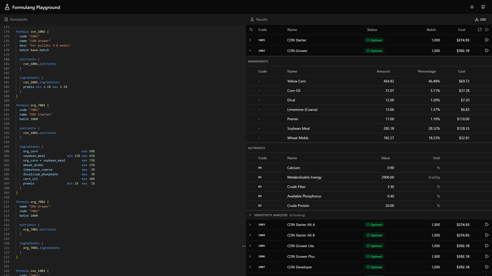

# Formulang

A domain-specific language for least-cost feed formulation. Define nutrients, ingredients, and formula constraints in a readable syntax, then solve for the optimal mix using linear programming.



**[Try the Live Demo](https://bherbruck.github.io/formulang/)**

## Features

- **Least-cost optimization** - Solves for the minimum cost formulation meeting all constraints
- **Reference expressions** - Access values from any definition with dot notation
- **Computed values** - Use expressions like `corn.cost * 2`
- **Nutrient ratios** - Constrain ratios like `lysine / methionine min 0.1`
- **Ingredient groups** - Constrain combinations like `corn + soybean_meal max 75%`
- **Templates** - Abstract definitions that aren't solved, useful for shared base configs

## Examples

### Nutrients

```
nutrient protein {
  code "02"
  name "Crude Protein"
  unit "%"
}

nutrient energy {
  code "01"
  name "Metabolizable Energy"
  unit "kcal/kg"
}

// Minimal definitions work too
nutrient lysine {}
nutrient methionine {}
```

### Ingredients

Define ingredients and reference values from other ingredients:

```
ingredient corn {
  name "Yellow Corn"
  cost 0.15
  nutrients {
    protein 7.5
    energy 3350
    fiber 2.2
  }
}

// Reference any ingredient's values
ingredient org_corn {
  name "ORG Corn"
  cost corn.cost * 2
  nutrients {
    corn.nutrients
    protein 8  // Override specific values
  }
}

ingredient soybean_meal {
  name "Soybean Meal"
  cost 0.45
  nutrients {
    protein 48.0
    energy 2230
    fiber 3.5
  }
}
```

### Formulas

Reference nutrients and ingredients from other formulas:

```
formula con_1001 {
  code "1001"
  name "CON Starter"
  desc "For chicks 0-3 weeks"
  batch 1000

  nutrients {
    protein     min   20    max   24
    energy      min 2900    max 2900
    fiber                   max    5
    calcium     min    0.9  max    1.2
    phosphorus  min    0.4  max    0.7
  }

  ingredients {
    corn                        max 50%
    soybean_meal        min 15% max 45%
    corn + soybean_meal         max 75%
    wheat_midds                 max 20%
    limestone                   max  3%
    premix              min  1% max  1%
  }
}

// Reference another formula's constraints
formula con_1002 {
  code "1002"
  name "CON Grower"
  batch 1000

  nutrients {
    con_1001.nutrients
  }

  ingredients {
    con_1001.ingredients
    corn_oil max 30%  // Add new constraint
  }
}

// Build variants quickly
formula con_1003 {
  code "1003"
  name "CON Grower Plus"
  batch 1000
  nutrients { con_1002.nutrients }
  ingredients {
    con_1002.ingredients
    corn_oil max 25%  // Override
  }
}
```

### Nutrient Ratios

Constrain nutrient ratios with named aliases:

```
formula starter {
  nutrients {
    protein min 20 max 24
    lysine min 12
    lysine / arginine   min 0.1 as lysine_arginine
    lysine / methionine min 0.1 as lysine_methionine
  }
  // ...
}

// Reference the named ratio constraint
formula grower {
  nutrients {
    protein min 18 max 22
    starter.nutrients.lysine_arginine
  }
  // ...
}
```

### Templates

Templates are just definitions that aren't solved - useful for shared base configurations:

```
template formula base {
  batch 1000
}

template formula high_protein {
  nutrients {
    protein min 22 max 26
  }
}

formula starter {
  batch base.batch
  nutrients {
    high_protein.nutrients
    energy min 2900
  }
  // ...
}
```

Templates work the same way for ingredients:

```
template ingredient grain_base {
  nutrients {
    fiber 2.5
    calcium 0.02
  }
}

ingredient corn {
  name "Yellow Corn"
  cost 0.15
  nutrients {
    grain_base.nutrients
    protein 7.5
    energy 3350
  }
}
```

## License

MIT
